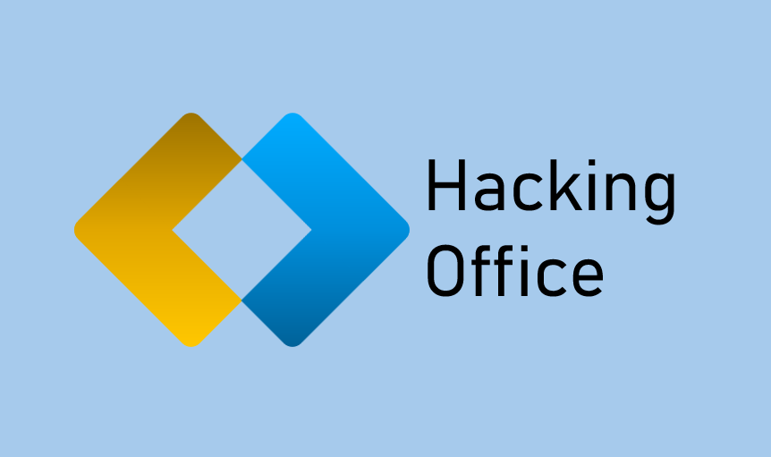

# Hacking-Office
Here you'll find some very simple pentesting software, all written in Python and very well commented. This project aims to be a hacking office suite for beginners.

The first program is SSH-Destructor.
It's an easy-to-use SSH bruteforce program.
It requires the following libraries: pyfiglet - paramiko - socket - time.
If you wish to run the code from the SSH server in question, use the loopback IP address: 127.0.0.1
