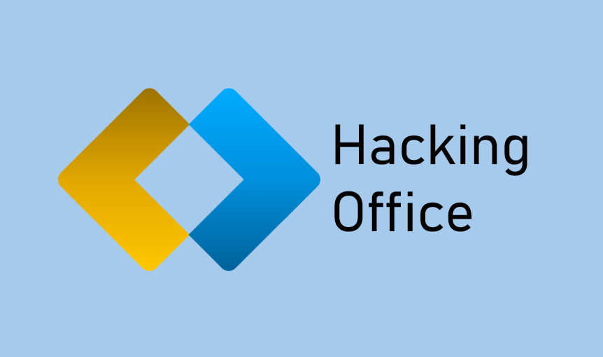

<div align="center">
    
</div>

<h3>Here you'll find some very simple pentesting software, all written in Python and very well commented. This project aims to be a hacking office suite for beginners.</h3>
<br>

<hr style="height:2px; background-color:gray; border:none;">
<br>

- <h4>The first program is SSH-Devastator V1.1.1.</h4>
It's an easy-to-use SSH bruteforce program.
<br>It requires the following libraries: pyfiglet - paramiko - socket - time.
<br>If you wish to run the code from the SSH server in question, use the loopback IP address: 127.0.0.1.

<br>
<hr style="height:2px; background-color:gray; border:none;">
<br>

- <h4>The second program is SnoopPort V1.0.1.</h4>
It's an easy-to-use ports scanner program.
<br>It requires the following libraries: pyfiglet - socket - time.
<br>If you wish to run the code from the computer in question, use the loopback IP address: 127.0.0.1.

<br>
<hr style="height:2px; background-color:gray; border:none;">
<br>

- <h4>The third program is IntruSpotter V1.0.</h4>
It's an easy-to-use program to scan an entire network and find the intrus and more...
<br>It requires the following libraries: pyfiglet - plyer - scapy - time.
<br>It also needs a few documents (.txt) which are in the directory.

<br>
<hr style="height:2px; background-color:gray; border:none;">
<br>

<h4>First stage :</h4>
To install the dependencies, you'll need to run one command depending the system you have. Don't hesitate to create a venv if you need.
First, with your terminal, navigate to the directory which contains the file <code>requirements.txt</code> :
<br><br>
Then, run this command :
<br><br>
Windows / Linux :

```shell
pip install -r requirements.txt
```
MacOS :
```shell
pip3 install -r requirements.txt
```
<br>

<hr style="height:2px; background-color:gray; border:none;">
<br>

<h4>Second stage :</h4>
Run the script <code>&ltscript_name&gt.py</code> and enjoy...
<br><br>

<hr style="height:2px; background-color:gray; border:none;">
<br>

<br><h5>Thanks to TechieNeurons who helped me for SSH-Devastator and SnoopPort.</h5>
